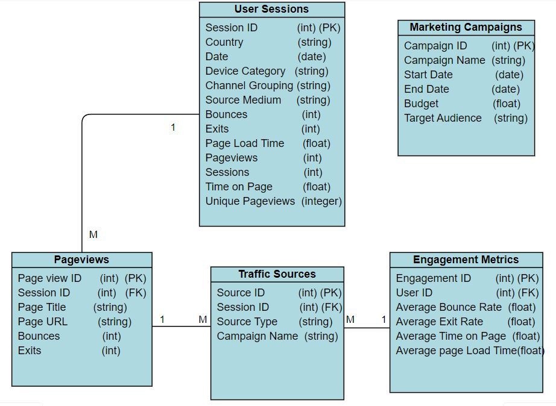
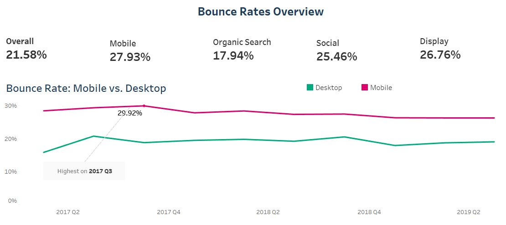
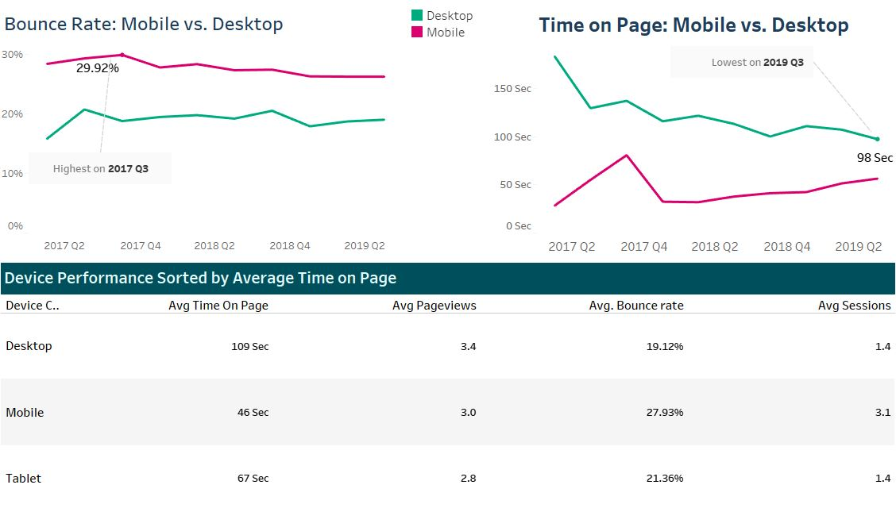
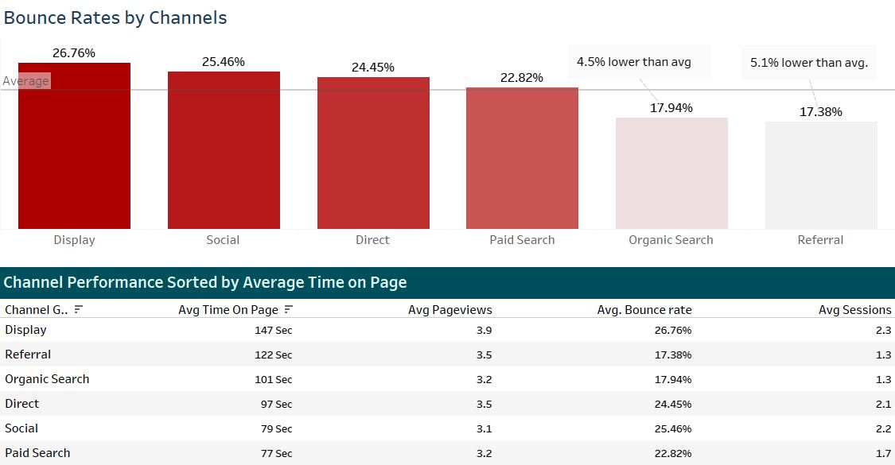
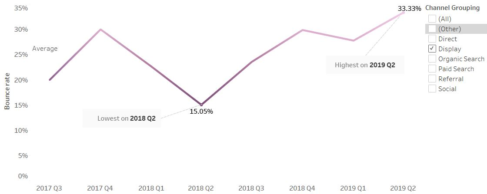
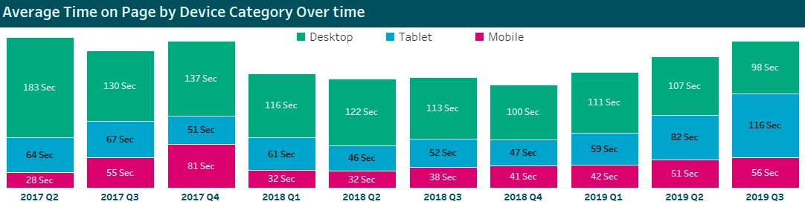

# Web Marketing Data Analysis

## Project Background

This analysis focuses on a mid-sized e-commerce company specializing in digital products and online services, operational for several years. The company combines direct online sales with a range of digital marketing strategies. The data analysed spans from Q2 2017 to Q3 2019, with key metrics of interest including user engagement, website performance, and conversion rates.

The analysis focused on the following key performance indicators (KPIs) to assess the online presence:
- **Average Bounce Rate**
- **Average Page Views**
- **Average Time on Page**
- **Average Sessions**
- **Average Exits**

Our **North Star** metric is **Average Time on Page**, serving as a crucial indicator of user engagement.

Insights and recommendations are provided on the following key areas:
- **User Engagement Optimization**: Identifying devices and channels with higher bounce rates and lower engagement to enhance user experience and content relevance.
- **Performance Measurement**: Analyzing how different devices and traffic channels influence key metrics like page views and session duration to evaluate marketing effectiveness. Additionally, tracking performance trends over time to assess the impact of past optimizations.
- **Resource Allocation**  : Understanding which devices and channels perform best to optimize marketing resource allocation and improve ROI through targeted strategies, such as mobile design enhancements and SEO improvements.

The **SQL queries** used to inspect and clean the data for this analysis can be found [here](./data_cleanup.sql).

A set of interactive **Tableau dashboards** used to report and explore sales trends can be found [here](https://public.tableau.com/views/MarketingDashboardFinal_17286652746830/MarketingDashboard?:language=en-GB&publish=yes&:sid=&:redirect=auth&:display_count=n&:origin=viz_share_link).

# Data Structure & Initial Checks

The main database for this project consists of approximately 250,000 rows, capturing a wide range of user interactions and website metrics. The data structure includes multiple tables that contain essential information on user sessions, page views, and engagement metrics. An Entity Relationship Diagram (ERD) is provided below to illustrate the relationships between these tables.

The processed **dataset** for this analysis can be accessed [here](https://docs.google.com/spreadsheets/d/188wNbFxbYcl5e9wCJU6vVWpz04zDUFDOYgOxyP1ilU0/edit?usp=sharing).

# Executive Summary

This analysis reveals critical insights into user engagement across devices and channels. Mobile bounce rates are alarmingly high at 27.93%, highlighting the urgent need for enhanced mobile optimization. In contrast, Organic Search performs well with a bounce rate of 17.94%, reflecting effective SEO strategies. However, Social Media (25.46%) and Display (26.76%) are underperforming, suggesting issues with content relevance and audience alignment. Addressing these gaps will be key to improving overall user engagement and driving higher traffic volumes.

# Insights Deep Dive

## User Engagement Metrics:
Mobile users have a high bounce rate of 27.93%, peaking at 29.92% in Q4 2017, which aligns with shorter attention spans and fragmented experiences. Despite frequent visits (3.1 sessions per user), mobile users explore less content (3 page views per session).

In contrast, desktop users engage more deeply, averaging 109 seconds on page (dropping to 98 seconds by Q3 2019) and 3.4 page views per session, but have fewer overall sessions (1.4). These trends emphasize the need for mobile optimization, as mobile users visit more often but engage less deeply, while desktop users show higher engagement quality per visit but with lower frequency.

Additionally, Display ads exhibited a significant spike in engagement, averaging 426 seconds on page in Q2 2018. This suggests effective ad placement and content alignment, highlighting the importance of ongoing optimization in ad strategies to maintain and enhance user engagement.

## Channel Performance:
Organic Search shows a robust bounce rate of 17.94%, which is 4.5% below the overall average of 22.4%, indicating effective SEO alignment with user intent. However, the average time on page is only 101 seconds, with sessions averaging 1.3. This suggests that while traffic is well-targeted, there may be opportunities to enhance content to retain visitor interest better.

Referral traffic performs similarly well, with a bounce rate of 17.38%, also 5.1% below the average, and a time on page of 122 seconds, leading to 3.5 page views per session. However, the low session count of 1.3 indicates room for improving user retention strategies, potentially through follow-up campaigns.

Social Media, despite its high bounce rate of 25.46%, has users who view an average of 3.1 pages but spend just 79 seconds on a page—suggesting users are quickly scrolling through content without deep interaction. Sessions per user are 2.2, which is encouraging for repeat visits but suggests that optimizing content to hold attention could further improve this channel’s performance.

Direct traffic sees an average time on page of 97 seconds and 3.5 page views, but a bounce rate of 24.45% highlights a need for better-tailored landing experiences for these visitors. The average time on page suggests users are somewhat engaged, but the bounce rate indicates they may not be finding what they expect, which calls for a review of landing page content and user experience.

Paid Search has a bounce rate of 22.82% and an average time on page of 77 seconds, with users viewing 3.2 pages per session. While these figures suggest reasonable engagement, the low time on page indicates users may not be fully engaging with the content. To optimize resource allocation, consider enhancing landing pages and ensuring ad alignment with user expectations to maximize ROI from this channel.

Display channels perform well in page views (3.9) and time on page (147 seconds) but suffer from a high bounce rate of 26.76%, indicating potential misalignment in audience targeting or content relevance. The recent peak in Q2 2019 continues an upward trend in bounce rates, rising from its low of 15% in Q2 2018. This suggests a need for a thorough review of content and audience alignment for display ads to reverse this trend.

## Device Usage Trends:
Desktop users initially led with the longest average time on page, reaching 183 seconds in Q2 2017, but this has steadily declined to 98 seconds by Q3 2019. This drop suggests users may not be finding content as engaging as before, necessitating ongoing investment in high-quality, relevant content that aligns with desktop users' needs.

Mobile users show a different trend: although they have the highest session count (3.1), their average time on page is shorter, indicating a fragmented user experience. The high bounce rate and low time on page suggest that mobile optimization and content accessibility improvements could help retain mobile visitors more effectively.

Tablet usage remains low and inconsistent, with time on page and engagement metrics underperforming compared to other devices. This points to a potential opportunity to develop more engaging content and user experiences tailored specifically to tablet users, who represent an underserved market segment with room for growth.

# Recommendations
Based on the insights and findings above, the marketing team should consider the following:
1. **Mobile Traffic's Higher Bounce Rate**: Mobile users exhibit a high bounce rate of 27.93%, necessitating immediate action. Prioritize responsive design enhancements, image optimization, and improved server response times to boost user engagement and reduce bounce rates.
2. **Sessions from Social Media**: With increasing social media engagement, explore targeted campaigns on platforms like Instagram and TikTok. Developing content strategies that focus on visual storytelling may enhance user engagement and further improve average time on page.
3. **Decline in Time on Page**: The average time on page for desktop users has dropped to 98 seconds, suggesting potential content issues. Conduct content audits on underperforming pages, gather user feedback, and implement A/B testing to identify improvement areas.
4. **SEO Performance and Organic Traffic Growth**: The rise in organic traffic, with a 17.94% bounce rate, indicates positive SEO results. Refine keyword strategies by utilizing long-tail keywords and enhance backlink initiatives through partnerships with industry blogs to further capitalize on this growth.

# Assumptions and Caveats
1. **Data Completeness**: It is assumed that the dataset provided is comprehensive and accurately reflects overall user engagement trends. However, missing or untracked sessions could impact insights, especially when allocating resources to underperforming channels.
2. **User Behaviour Consistency**: The analysis assumes that user behaviour patterns observed reflect typical engagement. External factors, such as seasonal trends or untracked marketing campaigns, may have influenced certain channels like Social Media and Paid Search, affecting the trends over time.
3. **Device Influence on Engagement**: The assumption is that higher mobile bounce rates align with industry standards, though specific device types (e.g., iOS vs. Android) and evolving user expectations may influence results. These considerations are important when planning mobile optimizations.
4. **Traffic Source Reliability**: Organic search performance assumes that search engine algorithms were stable throughout the analysis. Significant algorithm changes (e.g., Google updates) could have altered traffic trends, requiring adjustments to SEO strategies.
