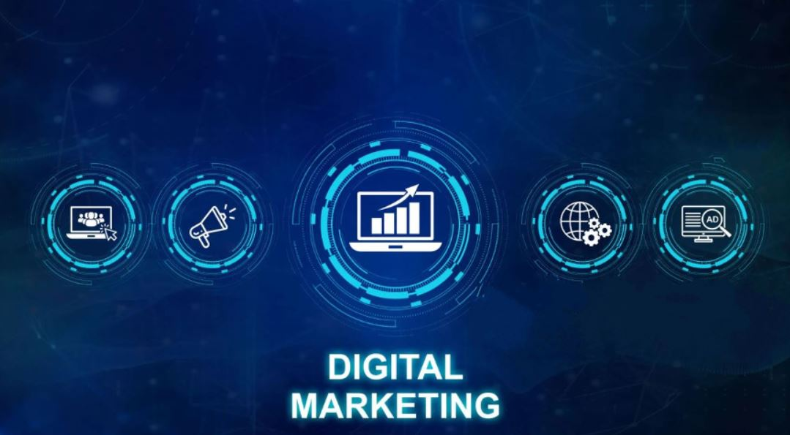

# Web Marketing Data Analysis

## Project Background

This analysis focuses on a mid-sized e-commerce company specializing in digital products and online services, operational for several years. The company combines direct online sales with a range of digital marketing strategies. The data analysed spans from Q2 2017 to Q3 2019, with key metrics of interest including user engagement, website performance, and conversion rates.

The analysis focused on the following key performance indicators (KPIs) to assess the online presence:
- **Average Bounce Rate**
- **Average Page Views**
- **Average Time on Page**
- **Average Sessions**
- **Average Exits**

Our **North Star** metric is **Average Time on Page**, serving as a crucial indicator of user engagement.

Insights and recommendations are provided on the following key areas:
- **User Engagement Optimization**: Identifying devices and channels with higher bounce rates and lower engagement to enhance user experience and content relevance.
- **Performance Measurement**: Analyzing how different devices and traffic channels influence key metrics like page views and session duration to evaluate marketing effectiveness. Additionally, tracking performance trends over time to assess the impact of past optimizations.
- **Resource Allocation**  : Understanding which devices and channels perform best to optimize marketing resource allocation and improve ROI through targeted strategies, such as mobile design enhancements and SEO improvements.

# Data Structure & Initial Checks

The main database for this project consists of approximately 250,000 rows, capturing a wide range of user interactions and website metrics. The data structure includes multiple tables that contain essential information on user sessions, page views, and engagement metrics. An Entity Relationship Diagram (ERD) is provided below to illustrate the relationships between these tables.

The processed **Dataset** for this analysis can be accessed [here](https://docs.google.com/spreadsheets/d/188wNbFxbYcl5e9wCJU6vVWpz04zDUFDOYgOxyP1ilU0/edit?usp=sharing).

The **SQL queries** used to inspect and clean the data for this analysis can be found [here](./data_cleanup.sql).

A set of interactive **Tableau dashboards** used to report and explore sales trends can be found [here](https://public.tableau.com/views/MarketingDashboardFinal_17286652746830/ChannelDashboard?:language=en-GB&publish=yes&:sid=&:redirect=auth&:display_count=n&:origin=viz_share_link). Additionally, you will find snapshots from these dashboards throughout the report, highlighting key insights.

# Executive Summary

- Overall Average Time on Page declined to 98 seconds by Q3 2019, but **Tablets average time on page nearly doubled since Q4 2018**, primarily due to significant improvements in Direct and Referral channels. Additionally, tablet bounce rates and exit rates have declined, reflecting enhanced user engagement in these key channels.

- **Mobile Bounce Rates** currently in this quarter at 26.3%, indicating that mobile users are struggling with engagement. Immediate action is needed to enhance mobile landing pages to improve user experience.

- Additionally, **across all device categories, 2017 Q4 marks a significant peak in several KPIs**, including sessions and page views, indicating a possible external factor, such as a marketing campaign or seasonal trend. This surge should be analysed for future optimization opportunities.

- **Sessions per User in the Direct channel increased by approximately 50% between Q2 2017 and Q4 2017, primarily from mobile devices**, with session counts reaching as high as 8.6. During this period, both page views and time on page improved notably for mobile users. However, ongoing efforts are required to replicate and maintain these gains, and to enhance ROI, particularly as the overall average time on page has since declined.

# Insights Deep Dive

## User Engagement Metrics:
- **Mobile users** have a persistently high bounce rate of 27.9%, peaking at 29.9% in Q4 2017. This suggests mobile users face challenges with engagement, requiring immediate enhancements to mobile landing pages. Despite a higher session frequency (3.1 sessions per user), mobile users explore relatively less content (3 page views per session). The average time on page dipped to its lowest at the start of 2018 and has been gradually improving, currently at 56 seconds. Enhancing mobile user experiences remains essential.

- **Tablet users** have shown significant improvements. Bounce rates declined from 26% in Q4 2017 to 16.5%, and average time on page nearly doubled from 47 seconds in Q4 2018 to 116 seconds by Q3 2019. This improvement highlights successful engagement strategies, particularly through Direct and Referral channels.

- **Desktop users** continue to demonstrate deeper engagement, with time on page starting at 109 seconds and decreasing to 98 seconds by Q3 2019. Bounce rates are stable (18-21%), and desktop users average 3.4 page views per session but visit less frequently (1.4 sessions per user). Desktop performance, though declining, remains robust relative to other devices.

## Channel Performance:
- **Organic Search**: A stable performer, with bounce rates between 17% and 19%, which is 4.5% below the overall average. The average time on page of 101 seconds leaves room for improvement in retaining highly targeted traffic longer.

- **Referral traffic**: Consistently good, with bounce rates at 17.38% (5.1% below the average), but lower session counts (1.3 per user). Time on page is strong at 122 seconds, suggesting room to enhance retention strategies for referral traffic.

- **Social Media**: Bounce rates have improved, declining from 33.3% in Q3 2017 to 24.6%. However, time on page remains low at 79 seconds, and users tend to skim through content quickly. The sessions per user rate of 2.2 suggests repeat visits, but deeper content engagement is needed.

- **Direct traffic**: Saw a significant spike in Q4 2017, with sessions per user jumping to 5.6. However, sustaining long-term interest has been challenging. While time on page improved from 22.7 seconds in Q4 2017, ongoing optimization of content and landing pages is necessary to maintain engagement.

- **Paid Search**: After peaking at a bounce rate of 25.6% in Q3 2017, rates have stabilized at 22.2%. However, the average time on page remains low at 77 seconds, indicating a need for better ad targeting and landing page alignment to increase engagement and ROI.

- **Display channels**: Display performance spiked in Q2 2018, with users spending an impressive average of 370 seconds on page. However, this was followed by a significant decline in average time on page and a surge in bounce rates, which increased from 15.1% in Q2 2018 to 30% by Q4 2018. Despite average page views of 3.9, the rising bounce rate indicates the need for refined audience targeting and improved content relevance to retain user engagement.

## Device Usage Trends:
- **Desktop users**: Started with high engagement levels, averaging 183 seconds per page in Q2 2017, but this steadily dropped to 98 seconds by Q3 2019. The decreasing time on page suggests a need for more engaging desktop content to maintain previous performance levels.

- **Mobile users**: Despite generating the highest session count (3.1 per user), mobile users show shorter average time on page and higher bounce rates. This indicates a fragmented user experience, requiring enhanced mobile optimization and better content accessibility to retain mobile visitors longer.

- **Tablet users**: Show significant growth in engagement, with average time on page nearly doubling from 47 seconds in Q4 2018 to 116 seconds by Q3 2019. This improvement stems from successful strategies targeting tablet users, particularly through Direct and Referral channels. With a historically lower performance, this upward trend presents a valuable opportunity to invest further in tablet-specific engagement strategies.

# Recommendations
Based on the insights and findings above, the marketing team should consider the following:
1. **Mobile Traffic's Higher Bounce Rate**: With a 27.93% bounce rate, prioritize responsive design, image optimization, and faster server response times to boost engagement. Focus on targeted content strategies to improve the time on page, currently 56.5 seconds.

2. **Exploit Tablet Growth**: With session times nearly doubling, develop content strategies to capitalize on this trend. Direct and Referral channels are performing well—enhancing campaigns here could yield significant benefits.

3. **Enhance Social Media Engagement**: Rising social media sessions create opportunities for targeted campaigns on Instagram and TikTok. Focus on visual storytelling to improve user engagement and time on page

4. **Improve Desktop Time on Page**: With time on page for desktop users down to 98 seconds, content audits and A/B testing are needed to identify and address underperforming areas.

5. **Strengthen SEO for Organic Growth**: Organic traffic shows promise with a bounce rate of 17.94%. Refine long-tail keyword strategies and expand backlink efforts through industry partnerships to sustain growth. 

# Assumptions and Caveats
1. **Data Completeness**: The dataset is assumed to fully represent user engagement trends. However, missing or untracked sessions could affect insights, particularly for underperforming channels. Display data is slightly limited (5-10%), which may influence the understanding of certain periods.

2. **User Behaviour Consistency**: The analysis assumes typical engagement patterns, but external factors like seasonal trends or untracked campaigns may influence certain channels. These should be considered when interpreting trends.

3. **Device Impact on Engagement**: It's assumed that mobile bounce rates align with industry standards, though device types (e.g., iOS vs. Android) and evolving user expectations may impact results. This should be factored in when optimizing for mobile.

4. **Traffic Source Reliability**: Organic search performance depends on stable search engine algorithms. Significant changes (e.g., Google updates) may affect traffic, requiring ongoing SEO adjustments.
